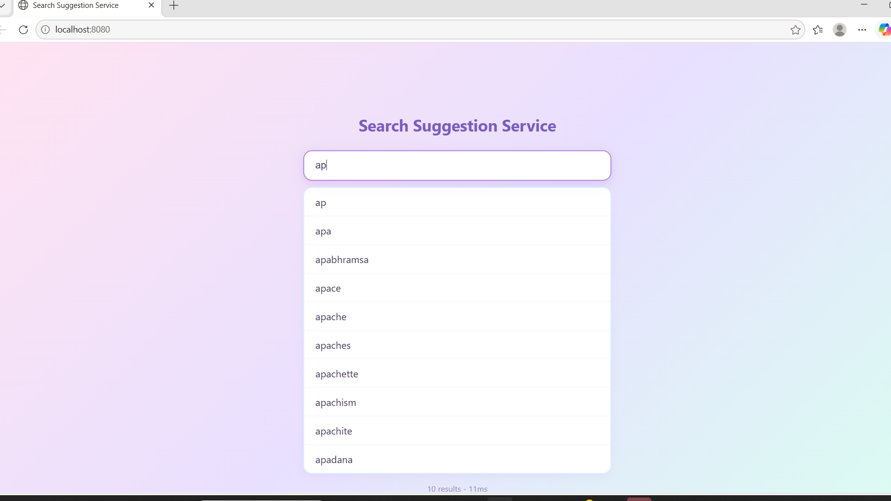
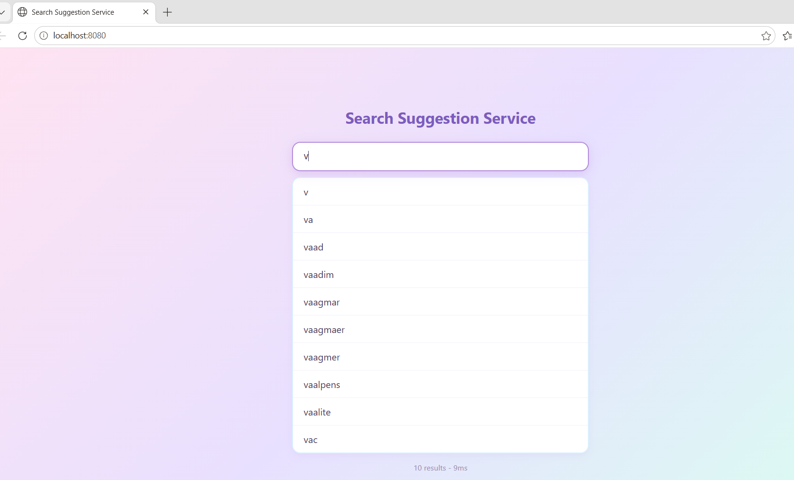

# Search Suggestion Service

A real-time autocomplete and typo-tolerant search engine built with Spring Boot, backed by a Trie data structure and a persistent database of 370,000+ English words. Includes a live search frontend with debounced queries.

<p align="center">
  
  <br><br>
  
</p>

Live demo: 10 suggestions returned in under 15ms, searched against a 370,105-word dictionary.

## Features

- **Prefix-based autocomplete** - instant suggestions as you type, powered by a custom-built Trie data structure (O(prefix length) lookup, independent of dictionary size)
- **Fuzzy search fallback** - typo-tolerant matching using Levenshtein (edit) distance; if no exact prefix match is found, the service automatically falls back to fuzzy matching (e.g. "aple" -> apple)
- **Persistent storage** - 370,000+ real English words stored in an H2 file-based database via Spring Data JPA, so data survives restarts without needing to reprocess the source word list every time
- **Bulk-optimized data loading** - dictionary is loaded from a source text file and inserted into the database in batches of 1,000 (rather than row-by-row), reducing initial load time from minutes to seconds
- **Live search frontend** - vanilla HTML/CSS/JS interface with debounced input (200ms) to avoid excessive API calls while typing
- **REST API** - a single, simple GET /api/search?q= endpoint returning JSON

## Architecture

```
Frontend (HTML/JS)
      |
      | GET /api/search?q=...
      v
SearchController
      |
      v
SearchService
   1. Try prefix match (Trie.autocomplete)
   2. If empty, fall back to fuzzy match (Trie.fuzzySearch + ldistance)
      |
      v
Trie (in-memory)  <-- loaded once at startup from --
      |                                              |
      v                                              |
H2 Database (Spring Data JPA / WordRepository) <------
      ^
      | seeded once, first run only
      |
words.txt (370,105 words)
```

**Why this design:**
- The **Trie lives in memory** for fast lookups on every request - no database round-trip per keystroke.
- The **database is the source of truth** - on every startup, DictionaryLoader checks if the database is already populated. If empty (first run), it bulk-loads words.txt into the database, then loads all words from the database into the Trie. On subsequent runs, it skips the file import and loads directly from the database into the Trie (~1 second for 370K words).
- **Prefix search runs first** since it's fast (proportional to prefix length). **Fuzzy search only runs as a fallback** when prefix search returns no results, since it's more expensive (Levenshtein distance computed against the full word list).

## Tech Stack

- **Backend:** Java 25, Spring Boot 4.1, Spring Data JPA
- **Database:** H2 (file-based, persistent)
- **Frontend:** Vanilla HTML, CSS, JavaScript (no framework)
- **Build tool:** Maven

## Project Structure

```
src/main/java/com/
  controller/
    SearchController.java      - REST endpoint: GET /api/search
  service/
    SearchService.java         - Business logic: prefix search + fuzzy fallback
  trie/
    Trie.java                  - Core Trie implementation (insert, autocomplete, fuzzySearch)
    t_node.java                - Trie node structure
  fuuzy/
    ldistance.java             - Levenshtein distance calculator
  loader/
    DictionaryLoader.java      - Bulk-loads words.txt into DB, then DB into Trie
  model/
    Word.java                  - JPA entity
    WordRepository.java        - Spring Data JPA repository
  config/
    TrieConfig.java            - Registers Trie as a shared Spring bean
  SearchSuggestionApplication.java

src/main/resources/
  words.txt                    - 370,105 English words (source: dwyl/english-words)
  application.properties       - DB and JPA configuration
  static/
    index.html                 - Search UI
    style.css
    script.js
```

## API

**Endpoint:** GET /api/search

**Query parameter:** q (string) - the search prefix or term

**Example request:**
```
GET /api/search?q=appl
```

**Example response:**
```json
["apple", "application", "apply", "appliance", "applesauce"]
```

If the query returns no prefix matches, the service automatically retries with fuzzy (typo-tolerant) matching before returning results.

## Running Locally

**Prerequisites:** Java 25, Maven (via included wrapper - no separate install needed)

1. Clone the repository:
```bash
git clone https://github.com/nazeeyabanuh/Search-Suggestion-Service.git
cd search-suggestion-service
```

2. Run the application:
```bash
./mvnw spring-boot:run
```
(On Windows: .\mvnw.cmd spring-boot:run)

On first run, the app will load 370,105 words into the H2 database (~5-10 seconds). Subsequent runs skip this step and start in a few seconds.

3. Open your browser:
```
http://localhost:8080/
```

## Performance Notes

- **Prefix search (Trie):** O(k) where k = length of the search prefix - independent of dictionary size. This is the key advantage over a naive SQL LIKE '%term%' query, which requires a full table scan (O(n) where n = total rows) since the wildcard prefix prevents index usage.
- **Fuzzy search:** O(n x m) where n = dictionary size and m = average word length, since it's a fallback-only operation and not used on every keystroke.
- **Bulk insert:** Loading 370K words individually via save() took several minutes in early testing; switching to saveAll() with 1,000-row batches (hibernate.jdbc.batch_size=1000) reduced this to ~5-6 seconds.

## Possible Future Improvements

- Response ranking (e.g. weight by word frequency, not just alphabetical/insertion order)
- Migrate from H2 to PostgreSQL for production deployment
- Add a response DTO with match type (exact vs fuzzy) and confidence score
- Unit tests for Trie, SearchService, and Levenshtein distance logic
- Caching layer for frequently searched prefixes

## Word List Source

Dictionary sourced from [dwyl/english-words](https://github.com/dwyl/english-words) (words_alpha.txt), a public list of ~370,000 English words commonly used in autocomplete, spell-check, and NLP tooling.